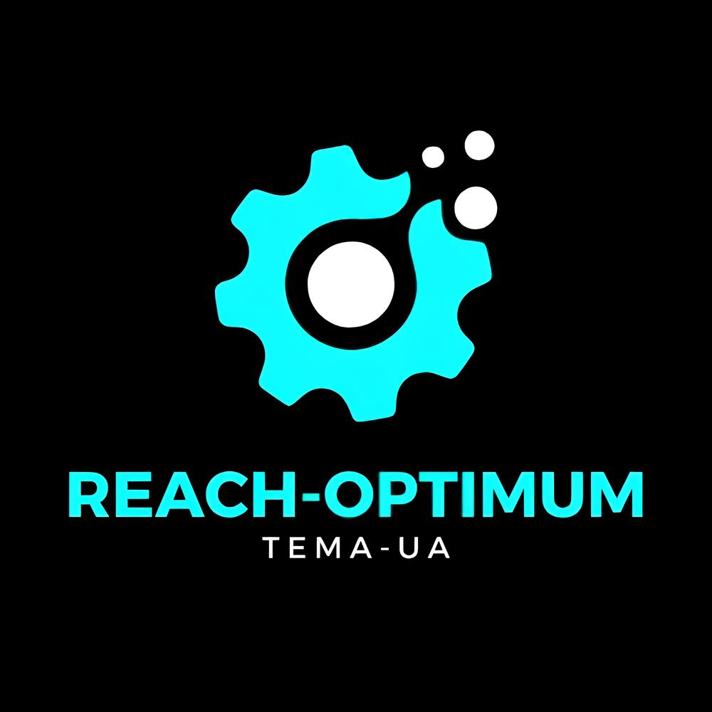

# ReachOptimum@TEMA

  

<strong>ReachOptimum@TEMA</strong> is a multidisciplinary research group at the <strong>Centre for Mechanical Technology and Automation (TEMA), University of Aveiro</strong>. We explore optimisation, data-driven decision support, and intelligent systems for engineering challenges with a strong focus on <strong>water systems</strong> and <strong>computational mechanics</strong>.

## 🚀 What we do
* 🎯 **Optimization & Operations Research** – metaheuristics, multi-objective optimisation, robust and sustainable decision-making

* 🤖 **AI/ML for Engineering** – predictive modeling, explainable AI, digital twins, and data-driven simulation

* 💧 **Water Systems** – smart water networks, leak detection, operational optimisation, and resilience

* ⚙️ **Computational Mechanics** - simulation, optimisation, constitutive modelling, parameter identification, and full-field experimental data

* 🔓 **Open Science & Reproducibility** – open datasets, notebooks, reference implementations, and reusable computational tools

## 💧 Water systems projects

Develop smart, efficient, and resilient water systems, combining optimization, artificial intelligence, and real-time decision support for water distribution networks. Our research supports integrated leak detection, operational planning, energy-aware control, and improved service quality in water utilities.

#### CENTRO2030-FEDER-01177300 &nbsp;•&nbsp; I-ReTiS-LeaksD&Op

[🌐 Website](https://www.ua.pt/pt/reachoptimum-tema/i-retis-leaksdandop)
&nbsp;•&nbsp;
[🗂️ Results & dissemination](https://zenodo.org/communities/mpr-2023-7-17394/records?q=&l=list&p=1&s=10)

#### 2024.07270.IACDC &nbsp;•&nbsp; I-ReTiS-Leaks

[🌐 Website](https://www.ua.pt/pt/reachoptimum-tema/i-retis-leaks)
&nbsp;•&nbsp;
[🗂️ Results & dissemination](https://zenodo.org/communities/1054499-2024-07270-iacdc/records?q=&l=list&p=1&s=10&)

#### COMPETE2030-FEDER-00823400 &nbsp;•&nbsp; I-ReTis-LeaksD&Op

[🌐 Website](https://www.ua.pt/pt/reachoptimum-tema/i-retis-leaksdandop-COMPETE2030)
&nbsp;•&nbsp;
[🗂️ Results & dissemination](https://zenodo.org/communities/mpr-2023-12-16946/records?q=&l=list&p=1&s=10&sort=newest)

## ⚙️ Computational mechanics projects

Develop data-efficient, interpretable computational mechanics models that combine finite element simulation, inverse identification, and machine learning to improve the reliability of advanced sheet metal forming predictions.

#### COMPETE2030-FEDER-00778700

[🌐 Website](https://compete2030.gov.pt/operacoes/listagem/COMPETE2030-FEDER-00778700/)

## 📫 How to reach us
[🌐 Website](https://www.ua.pt/pt/reachoptimum-tema)
&nbsp;•&nbsp;
[🔗 LinkedIn](https://www.linkedin.com/company/reachoptimum)
&nbsp;•&nbsp;
[🔴 YouTube](https://www.youtube.com/@ReachOptimum-TEMA)
&nbsp;•&nbsp;
[✉️ Email](mailto:reachoptimum.tema@gmail.com)

